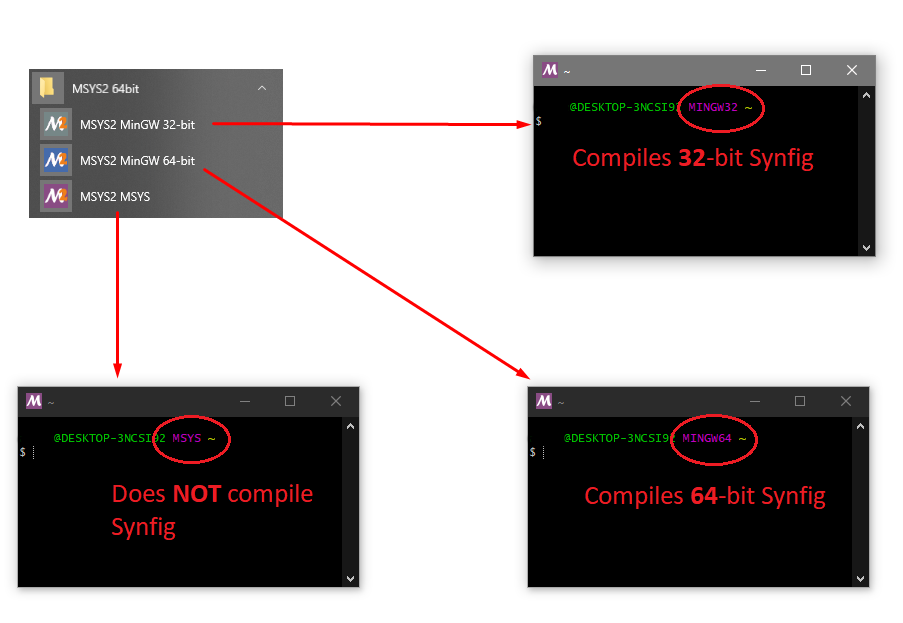

.. _cmake:

Synfig Using CMake
==================

Synfig is written in C++, based on GTK3 library. This documentation uses CMake for building. Synfig can also be built using aututools/make. Check that out on :ref:`this page <building>`.

Build system: CMake

Preparing Environment
~~~~~~~~~~~~~~~~~~~~~~

Building Synfig requires many dependent libraries installed for your system. For full list of libraries please refer to :ref:`this page <dependencies>`.

Below you will find instructions how to install them on various operating systems.

Linux
-------

First of all make sure you have "git" installed. Use it to fetch Synfig's sources:

.. code:: bash

    $ git clone https://github.com/synfig/synfig.git ~/synfig.git
    
Then navigate to sources directory:

.. code:: bash

    $ cd ~/synfig.git
    
Now you need to install all required dependencies. This is easy to do by running a special script shipped with Synfig's sources:

.. code:: bash

    $ ./1-setup-linux-native.sh

Wait till the script finish installing dependencies and you're ready to build.
    
OSX
-------

We will be running all commands in terminal, so start by launching Terminal app.

First you need to install Xcode Command Line Tools with the following command:

.. code:: bash

    $ xcode-select --install
    
Follow instructions on the screen to complete installation.

Next, get Synfig's sources:

.. code:: bash

    $ git clone https://github.com/synfig/synfig.git ~/synfig.git
    
When download finishes, navigate to sources directory:

.. code:: bash

    $ cd ~/synfig.git
    
Now we can install all required libraries via HomeBrew. There is a special script included with sources:

.. warning::
    It is NOT recommended to use this method on OSX version < 10.11 with already working Homebrew - with almost 100% probablility your Homebrew installation will be damaged. You've been warned.
    
    For more details about this issue see here - https://github.com/synfig/synfig/blob/678cc3a7b1208fcca18c8b54a29a20576c499927/1-setup-osx-brew.sh#L34-L37
    
.. code:: bash

    $ ./1-setup-osx-brew.sh
    
Depending on version of your system the process of installing dependencies might take some time. When it completes you are ready to build Synfig! 

Windows
-------

.. note::
    For compiling Synfig on Windows we use MinGW installation in MSYS2 environment.
    
    Alternative for that approach could be to build using MSVC and Microsoft vcpkg (https://github.com/microsoft/vcpkg), but we haven't digged into that yet. Any help on this matter is appreciated here - https://github.com/synfig/synfig/issues/860.

Download and install MSYS2, following instructions here - http://www.msys2.org/.

Make sure to select the correct MSYS as per your needs. 

Always use the proper shell:

    * **MinGW32** for compiling **32**-bit Synfig.
    * **MinGW64** for compiling **64**-bit Synfig.
    * **Never** use the **MSYS** shell for compiling Synfig.

After picking the needed MSYS Shell.

.. code:: bash

    $ pacman -S git

Next, get Synfig's sources:

.. code:: bash

    $ git clone https://github.com/synfig/synfig.git ~/synfig.git
    
When download finishes, navigate to sources directory:

.. code:: bash

    $ cd ~/synfig.git

Now you need to install all required dependencies. Run a special script shipped with Synfig's sources:

.. code:: bash

    $ ./1-setup-windows-msys2.sh

Wait till the script finish installing dependencies. Now install CMake and Ninja with:

    * For MINGW32:
    .. code:: bash

        $ pacman -S mingw-w64-i686-cmake mingw-w64-i686-ninja

    * For MINGW64:
    .. code:: bash

        $ pacman -S mingw-w64-x86_64-cmake mingw-w64-x86_64-ninja

When it completes you are ready to build Synfig! 

    
Building using CMake
~~~~~~~~~~~~~~~~~~~~~~~
